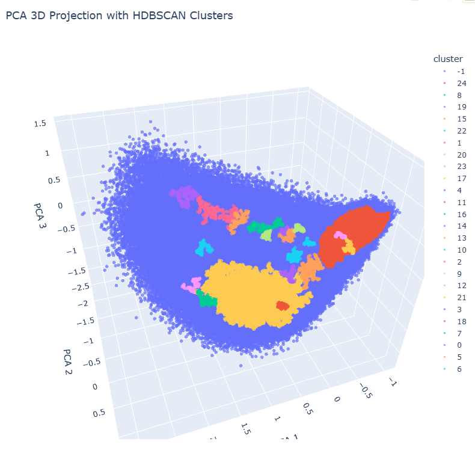
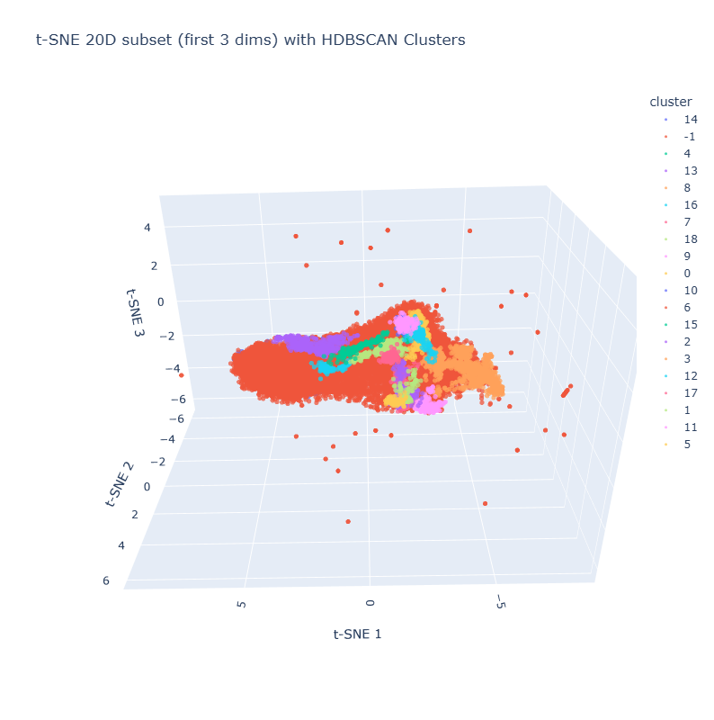

# Posidonia Soundscapes: Audio Clustering & Embedding Analysis

A comprehensive pipeline for extracting embeddings from underwater audio recordings, clustering them using multiple algorithms, and analyzing cluster quality through dimensionality reduction and visualization.

**392,400 five second audio segments clustered with no manual labels, 25 distinct groups isolated by the best configuration (PCA 3D + HDBSCAN), validated across 8 dimensionality reduction and clustering combinations.**

## Overview

This project processes large-scale audio datasets (392,400 five second Posidonia marine soundscape segments) by:

1. **Extracting embeddings** using Google's PerchV2 model, a bird and nature sound recognition model repurposed here for underwater bioacoustic audio
2. **Creating manifests** of audio files with associated metadata
3. **Clustering embeddings** using multiple algorithms (K-means, HDBSCAN)
4. **Dimensionality reduction** using PCA, UMAP, and t-SNE for 3D/20D visualizations
5. **Evaluating cluster quality** with diagnostic metrics and visualizations
6. **Sampling representative** examples from clusters for manual review

## Project Structure

```
.
├── README.md                          # This file
├── Review/                            # High-priority clustering results for manual review
│   ├── PCA_3D_HDBSCAN/               # PCA 3D + HDBSCAN clustering
│   ├── UMAP_TSNE_3D_HDBSCAN/         # UMAP/t-SNE 3D + HDBSCAN
│   ├── UMAP_TSNE_3D_Kmeans/          # UMAP/t-SNE 3D + K-means
│   └── UMAP_TSNE_20D_HDBSCAN/        # UMAP/t-SNE 20D + HDBSCAN
│
├── NoReview/                          # Alternative clustering methods (lower priority)
│   ├── PCA_256D_HDBSCAN/             # High-dimensional clustering (256D)
│   ├── PCA_256D_Kmeans/              # K-means on 256D PCA
│   ├── PCA_3D_Kmeans/                # K-means on 3D PCA
│   └── UMAP_TSNE_3D_Silhouette/      # Silhouette score evaluation
│
└── src/                               # Source code and utilities
    ├── create_unlabeled_manifest.py  # Build audio file manifests
    ├── embed_and_sample_perch (1).py # PerchV2 embedding extraction
    └── copy/
        ├── diagnostics/              # Diagnostic CSV outputs
        └── Tries/                    # Clustering & sampling scripts
            ├── build_clustered_samples.py      # Sample 100 per cluster
            ├── build_diagnostics_csv.py        # Generate diagnostic metrics
            ├── build_saved_subsample_strategy_csv.py
            ├── check_sample_vs_sources.py
            ├── copy_true_5seg_audio.py        # Copy audio segments
            ├── copy_true_5seg_audio_strategy_b.py
            └── 5th_approach.py
```

## Key Components

### Embedding Extraction (`embed_and_sample_perch`)

Extracts embeddings from audio using Google's PerchV2 model:

- **Input**: Raw audio files (~5 seconds each)
- **Output**: Audio embeddings as `.npy` files
- **Features**:
  - Automatic zero-padding for audio < 5 seconds
  - Centered 5-second window extraction for audio > 5 seconds
  - Optional audio segment WAV file generation
  - Optional diagnostic spectrograms and t-SNE plots

### Manifest Creation (`create_unlabeled_manifest.py`)

Builds a structured manifest of audio files:

- Creates CSV with `audio_path` and `embedding_path` columns
- Extracts audio properties (duration, sample rate)
- Handles multiple column naming conventions
- Normalizes paths for Windows/WSL compatibility

### Clustering & Evaluation

Multiple clustering approaches explored:

| Method | Dimensions | Algorithm | Status |
|--------|-----------|-----------|--------|
| UMAP_TSNE_3D_Kmeans | 3D | K-means | **Review** |
| UMAP_TSNE_3D_HDBSCAN | 3D | HDBSCAN | **Review** |
| UMAP_TSNE_20D_HDBSCAN | 20D | HDBSCAN | **Review** |
| **PCA_3D_HDBSCAN** 🏆 | 3D | HDBSCAN | **Review, best result (25 clusters)** |
| PCA_3D_Kmeans | 3D | K-means | No Review |
| PCA_256D_HDBSCAN | 256D | HDBSCAN | No Review |
| PCA_256D_Kmeans | 256D | K-means | No Review |
| UMAP_TSNE_3D_Silhouette | 3D | Silhouette score | No Review |

### Cluster Sampling

The pipeline samples up to 100 representative audio examples per cluster using:

- `build_clustered_samples.py`: Sample from each clustering result
- `check_sample_vs_sources.py`: Validate sample consistency
- `copy_true_5seg_audio.py`: Copy sampled audio segments to review folders

Diagnostic outputs saved in `src/copy/diagnostics/`:
- Cluster statistics CSV files
- Method comparison matrices
- Filtered vs. unfiltered results

## Notebooks

Each clustering method has two associated Jupyter notebooks:

1. **`cluster_XX.ipynb`**: Embedding extraction, dimensionality reduction, and clustering logic
2. **`visualize_XX.ipynb`**: Interactive 3D/2D visualizations and cluster analysis

Example workflow:
```
Review/UMAP_TSNE_3D_Kmeans/
  ├── cluster_01.ipynb     # Run clustering pipeline
  └── visualize_01.ipynb   # Analyze and visualize results
```

## Data Paths

The project references the following directory structure (configurable via environment variables):

```
D:\Posidonia Soundscapes\
  Fondeo 1_Formentera Ille Espardell\
    ├── Embeddings_2/           # PerchV2 embeddings (.npy files)
    ├── Original_audio/         # Raw audio files
    └── dataset/
        ├── unlabeled_manifest.csv
        └── unlabeled_embeddings.npy
```

### Environment Variables

- `POSIDONIA_EMBEDDINGS2_DIR`: Override embeddings directory path
- `POSIDONIA_DATASET_DIR`: Override dataset directory path (uses parent as Embeddings_2)

## Workflow

### 1. Prepare Data

```bash
python src/create_unlabeled_manifest.py \
  --index path/to/audio_index.csv \
  --manifest-out data/unlabeled_manifest.csv \
  --embeddings-out data/unlabeled_embeddings.npy
```

### 2. Extract Embeddings

```bash
python src/embed_and_sample_perch.py \
  --audio-dir data/audio \
  --embeddings-out output/embeddings \
  --diagnostics  # Optional
```

### 3. Run Clustering Notebooks

- Open notebooks in Review/ or NoReview/ folders
- Execute clustering algorithms
- Generate dimensionality reduction projections

### 4. Evaluate & Sample

```bash
python src/copy/Tries/build_clustered_samples.py
python src/copy/Tries/build_diagnostics_csv.py
```

### 5. Visualize Results

- Open visualization notebooks
- Explore 3D/2D projections
- Identify high-quality clusters

## Technologies

- **Embeddings**: [Google PerchV2](https://github.com/google-research/perch) - bird sound recognition model
- **Clustering**: scikit-learn (K-means, HDBSCAN)
- **Dimensionality Reduction**: PCA, UMAP, t-SNE
- **Audio Processing**: librosa, soundfile
- **Data Processing**: pandas, numpy
- **Visualization**: matplotlib, Jupyter notebooks
- **ML Framework**: TensorFlow (for PerchV2)

## Key Findings

- **Scale**: all 392,400 five second segments were embedded and scored across every configuration below, not a sample
- **PCA_3D_HDBSCAN** 🏆: the best result, dense and well separated cluster groups with good specificity (25 distinct clusters identified directly from raw audio, no manual labels used)
- **UMAP_TSNE_3D_Kmeans** and **UMAP_TSNE_3D_HDBSCAN**: high-quality 3D projections with clear cluster separation, an independent method that confirms the same underlying structure
- **20D approaches**: better semantic separation than 3D for HDBSCAN results
- High-dimensional (256D) clustering: useful for technical evaluation but less interpretable

### Results, visualized

**PCA reduced to 3 dimensions with HDBSCAN clustering, the winning configuration (25 distinct clusters):**



**t-SNE reduced to 20 dimensions (first 3 shown) with HDBSCAN clustering, an independent confirmation that the same structure holds under a different reduction method:**



## Notes

- Audio segments standardized to ~5 seconds for consistent embedding extraction
- HDBSCAN identifies noise points; K-means assigns all points to clusters
- Review folder prioritizes interpretable, actionable clustering results
- Diagnostic CSVs track cluster composition and quality metrics
- Windows path normalization supports WSL execution

## Future Improvements

- Automated cluster quality metrics (silhouette score, Davies-Bouldin index)
- Hierarchical clustering visualization
- Interactive web-based cluster explorer
- Integration with ground-truth labels for supervised evaluation
- Streaming/online clustering for large-scale data

